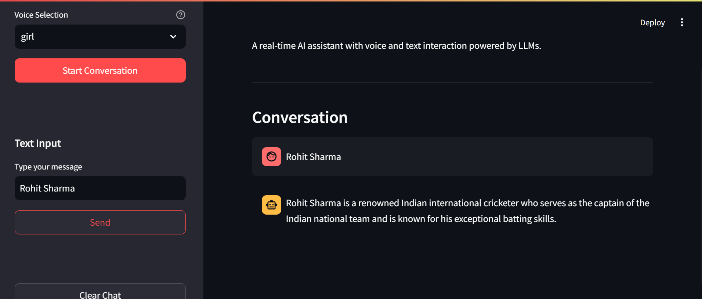

# 🎙️ AI Voice Assistant

A real-time AI Voice and Text Assistant built using **Python**, **Streamlit**, and the **Groq LLM API**. The application enables users to interact with an AI-powered assistant through both text and voice interfaces, providing conversational AI capabilities powered by Large Language Models (LLMs).

The project demonstrates the integration of AI APIs, speech recognition, text-to-speech systems, cloud deployment workflows, and interactive web application development.

---

> ⚠️ **Important Notice**
>
> * 🎤 Microphone access is required for voice interaction.
> * 💻 Voice input and text-to-speech functionality work best when running locally.
> * ☁️ Due to browser and cloud environment limitations, the deployed version primarily supports text-based conversations.
> * 🚀 For the complete voice-enabled experience, clone the repository and run it locally.
> * 🔐 API keys should never be exposed publicly and must be stored using environment variables.

---

## 🚀 Features

### 🤖 Conversational AI

* Real-time AI-powered conversations using Groq LLM APIs
* Context-aware responses with session-based chat history
* Fast and interactive user experience

### 🎤 Voice-to-Text

* Converts spoken input into text using SpeechRecognition
* Supports hands-free interaction with the assistant
* Ambient noise adjustment for improved speech recognition

### 🔊 Text-to-Speech

* Converts AI responses into spoken output
* Multiple voice selection options
* Adjustable speech rate and volume

### 💬 Text-Based Chat Interface

* Streamlit-powered chat interface
* Supports both text and voice interaction workflows
* Real-time response generation

### ☁️ Cloud Deployment Support

* Deployed using Streamlit Cloud
* Environment-aware handling for deployment limitations
* Automatic fallback to text-based interaction when voice hardware is unavailable

### 🔒 Secure API Handling

* Environment variable-based API key management
* No hardcoded credentials
* GitHub-safe deployment workflow

---

## 🛠️ Technology Stack

### Programming Language

* Python

### AI & LLM

* Groq API
* Llama 3.3 70B Versatile

### Frontend & Deployment

* Streamlit
* Streamlit Cloud

### Voice Processing

* SpeechRecognition
* pyttsx3

### Utilities

* python-dotenv
* Git
* GitHub

---

## 🏗️ System Architecture

```text
User Input (Voice/Text)
          │
          ▼
Speech Recognition (Optional)
          │
          ▼
      Groq LLM API
          │
          ▼
 AI Response Generation
          │
          ▼
 Text Display in Streamlit
          │
          ▼
Text-to-Speech (Local Only)
```

---

## ⚙️ Installation & Setup

### 1. Clone the Repository

```bash
git clone https://github.com/yourusername/voice-assistant-chatbot.git
cd voice-assistant-chatbot
```

### 2. Create a Virtual Environment

```bash
python -m venv venv
```

### Activate the Environment

#### Windows

```bash
venv\Scripts\activate
```

#### Linux / macOS

```bash
source venv/bin/activate
```

---

### 3. Install Dependencies

```bash
pip install -r requirements.txt
```

---

### 4. Configure API Key

Create a `.env` file in the project root directory.

```env
GROQ_API_KEY=your_groq_api_key_here
```

---

### 5. Run the Application

```bash
streamlit run app.py
```

---

## 📌 Deployment Notes

### Local Execution

✅ Voice Input Supported

✅ Text-to-Speech Supported

✅ Full Assistant Functionality Available

### Cloud Deployment

✅ Text-Based Chat Supported

✅ LLM Response Generation Supported

❌ Direct Microphone Access Not Available

❌ System Speaker Output Not Available

This behavior is expected because cloud-hosted environments do not have direct access to local audio hardware.

---

## 🚧 Engineering Challenges Solved

### API Security

* Resolved GitHub secret scanning issues
* Implemented secure API key management using environment variables
* Prevented accidental credential exposure

### Cloud Deployment Constraints

* Handled microphone limitations in cloud environments
* Implemented graceful fallback to text interaction
* Added deployment-aware execution logic

### Dependency Management

* Addressed PyAudio compatibility challenges
* Improved application stability across environments
* Debugged deployment-specific issues

---

## 📷 Demo

### Application Screenshot

```markdown

```

Replace the image path with your actual screenshot location.

---

## 🎯 Learning Outcomes

Through this project, I gained practical experience in:

* Large Language Model (LLM) Integration
* Conversational AI Development
* API Integration
* Speech Recognition Systems
* Text-to-Speech Systems
* Streamlit Application Development
* Cloud Deployment
* Session State Management
* Environment Variable Handling
* Software Debugging & Troubleshooting

---

## 🔮 Future Improvements

* Browser-based voice input support
* Multi-language conversations
* Conversation export functionality
* User authentication
* Persistent chat history
* Voice cloning and customization

---

## 👨‍💻 Author

### Jinne Sri Teja Reddy

* LinkedIn: https://linkedin.com/in/your-profile
* GitHub: https://github.com/sritejreddy04

Feel free to connect, provide feedback, or contribute to the project.
